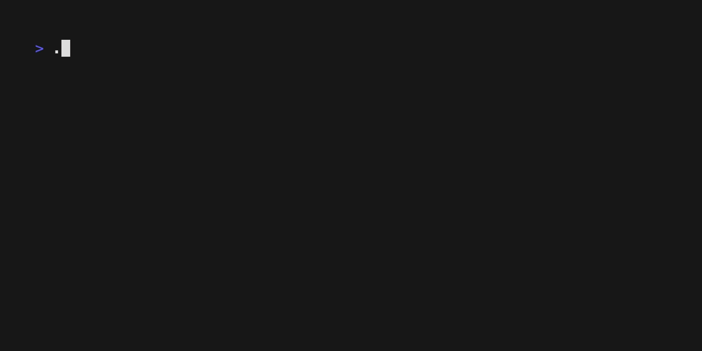

# FancyHackerTerminal

FancyHackerTerminal is a command-line interface (CLI) application written in .NET, designed to display text in a "hackery" style, reminiscent of classic computer hacker scenes in movies. It offers customizable options for text and background colors, text display speeds, and the ability to use either custom code snippets from a file or generate random code.



## Features

- Customizable Text Color: Choose from various colors for the text display.
- Adjustable Background Color: Set your preferred background color for the console.
- Code File Input: Use a specific file's content for the text display or opt for random generated code.
- Speed Control: Set minimum and maximum speeds for text animation, offering a dynamic visual effect.

## Options 

**Text Color (--textcolor)**\
Sets the color of the text displayed in the console. The value must be a valid name from the ConsoleColor enumeration.

*Example Usage:* Sets the text color to Cyan. Throws an exception if an invalid color name is provided.
```
./FancyHackerTerminal --textcolor Cyan
```

**Background Color (--backgroundcolor)**\
Sets the console's background color. Like textcolor, the value must be a valid ConsoleColor.

*Example Usage:* Sets the background color to DarkBlue. Throws an exception for invalid color names.
```
./FancyHackerTerminal --backgroundcolor DarkBlue
```

**Code File (-f or --codefile)**\
Specifies the path to a text file whose content will be displayed. If this option is not provided, the program generates and displays random code.

*Example Usage:* Uses the text from sample.txt located in the current directory for the display.
```
./FancyHackerTerminal --codefile "./sample.txt"
```

**Minimum Speed (--min)**\
Defines the minimum speed of the text animation, controlling how quickly the text appears. The value is an integer.

*Example Usage:* Sets the minimum text animation speed to 20.
```
./FancyHackerTerminal --min 20
```

**Maximum Speed (--max)**\
Defines the maximum speed of the text animation. This value is an integer and should be greater than or equal to the minimum speed.

*Example Usage:* Sets the maximum text animation speed to 150.
```
./FancyHackerTerminal --max 150
```

**Number of Lines (--lines)**\
Sets the number of lines to be printed by the program. This allows for controlling the length of the output directly.

*Example Usage:* Configures the program to print exactly 50 lines of text.
```
./FancyHackerTerminal --lines 50
```

**Help (-h or --help)**\
Displays usage information about the application and exits. This is useful for quickly accessing the command syntax and options.

*Example Usage:* Shows the help information, explaining how to use all available options.
```
./FancyHackerTerminal --help
```

### Combination

Each option provides a way to customize the behavior and appearance of the text display, allowing for a personalized experience. Options can be combined in a single command to configure multiple settings at once, for example:

```
./FancyHackerTerminal --textcolor Green --backgroundcolor Black --min 10 --max 100 --lines 30
```

This command sets the text color to Green, the background color to Black, establishes a text animation speed range between 10 and 100, and limits the output to 30 line

## Installing From Binary

You can simply download and use the compiled binary program from the releases section of the [GitHub Project](https://github.com/fdmomtaz/FancyHackerTerminal/releases).

## Build Instructions

Follow these simple steps to build FancyHackerTerminal from the source code:

### Prerequisites
Before you begin, ensure you have the following installed:

.NET Core SDK (version 6.0 or later). You can download it from [Microsoft's .NET download page](https://dotnet.microsoft.com/en-us/download).

### Steps to Build

1. Clone the Repository:
First, clone the FancyHackerTerminal repository to your local machine using Git.
``
git clone https://github.com/fdmomtaz/FancyHackerTerminal.git
``

2. Navigate to the Project Directory:
Change to the directory containing the cloned source code.
``
cd FancyHackerTerminal
``

3. Build the Project:
Use the .NET Core CLI to build the project.
``
dotnet build
``

This command compiles the application and generates executables or DLLs in the `bin` folder.

## Support

If you have any questions, encounter bugs, or need assistance using FancyHackerTerminal, please feel free to open an issue on our GitHub Issues page. We welcome your feedback and contributions to help improve FancyHackerTerminal.

For more detailed questions or discussions, consider using the Issues section on the GitHub repository. This is a great place to share ideas, ask for help with more complex issues, or discuss potential features.

## Contribution

We welcome contributions to FancyHackerTerminal. You can contribute by forking the repository, making your changes, and submitting a pull request. For more detailed instructions.

## License

FancyHackerTerminal is open-sourced software licensed under the MIT license.